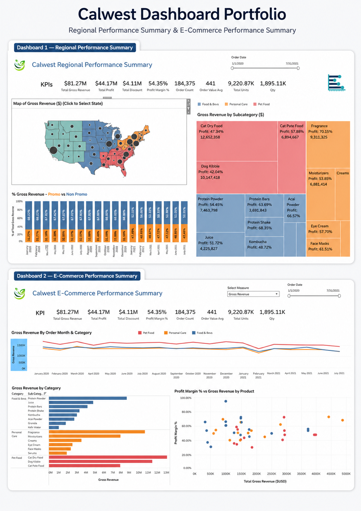
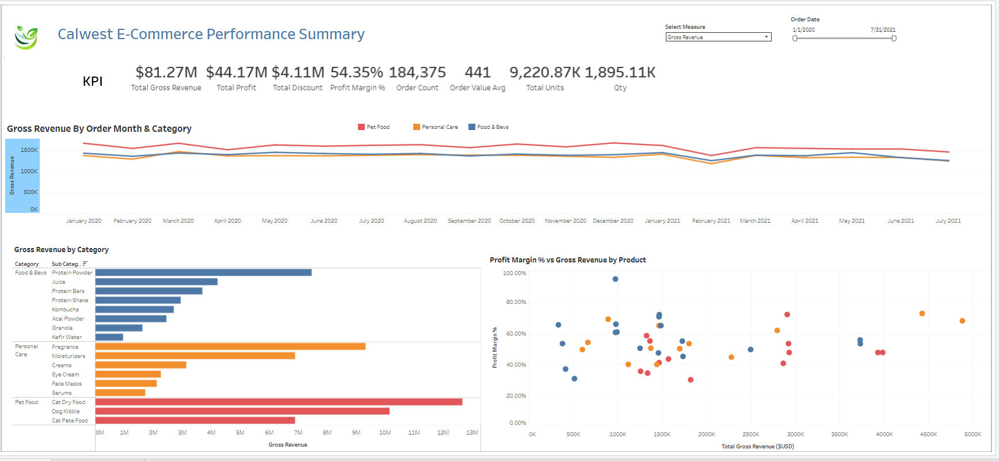
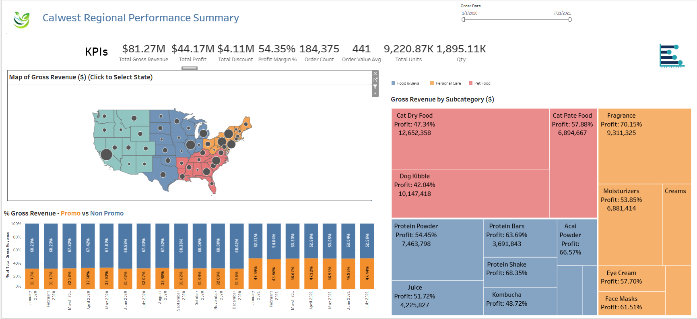

# Calwest E-Commerce Analytics Dashboard | Tableau

[](https://public.tableau.com/app/profile/ijash.ahmed.z/viz/Calwest_Ecommerce_Analytics_Dashboard/E-CommercePerformanceSummary)
[](tableau/Calwest_Ecommerce_Analytics_Dashboard.twbx)

An interactive Tableau dashboard suite analysing e-commerce performance across revenue, profit, discounts, orders, products, promotions and US regional trends across **251,431 order lines**.



> This repository includes my completed packaged Tableau workbook, original dashboard exports and independently validated aggregate results. Course-provider slides, pre-completed workbooks and unlicensed raw datasets are intentionally excluded.

## Dashboard 1 — E-Commerce Performance Summary



This dashboard provides an executive overview of commercial performance and product profitability.

- KPI tracking for gross revenue, profit, discount, profit margin, order count, average order value, total units and quantity
- Monthly gross-revenue trends by category
- Category and subcategory revenue comparison
- Product-level profit-margin versus revenue analysis
- Measure selector for dynamic analysis
- Interactive order-date filtering

## Dashboard 2 — Regional Performance Overview



This dashboard focuses on geographic and promotional performance.

- US state map with state-level selection and cross-filtering
- Gross revenue by subcategory using a treemap
- Promotion versus non-promotion revenue share by month
- Shared KPI summary for revenue, profit, discount, margin, orders and units
- Interactive date filtering and dashboard actions

## Verified results

| Metric | Result |
|---|---:|
| Order lines | 251,431 |
| Distinct orders | 184,375 |
| Customers | 12,246 |
| Products | 44 |
| Gross revenue | $81.27M |
| Profit | $44.17M |
| Profit margin | 54.35% |
| Discount | $4.11M |
| Average order value | $440.79 |

## Key findings

- **Very Berry Parfum** was the highest-revenue product at approximately **$4.88M**.
- The **East** was the highest-revenue region at approximately **$22.10M**.
- **Cat Dry Food** was the highest-revenue subcategory at approximately **$12.65M**.
- Promotion-linked revenue reached its highest monthly share in **January 2021**, at approximately **47.49%**.

## Tools and techniques

- Tableau Public
- Tableau relationships and multi-table data modelling
- Calculated fields and parameters
- Dashboard actions and interactive filtering
- Maps, treemaps, line charts, bar charts and scatter plots
- Python and Pandas for independent metric validation

## Repository structure

```text
assets/       Original dashboard screenshots and combined portfolio preview
data/         Source-data availability and privacy note
docs/         Methodology, data model, calculations and findings
outputs/      Aggregate validation results
scripts/      Reproducible Python validation script
tableau/      Completed packaged Tableau workbook
```

## Open the interactive dashboard

- [View the live dashboard on Tableau Public](https://public.tableau.com/app/profile/ijash.ahmed.z/viz/Calwest_Ecommerce_Analytics_Dashboard/E-CommercePerformanceSummary)
- Download `tableau/Calwest_Ecommerce_Analytics_Dashboard.twbx` to inspect both dashboards in Tableau Desktop.

The workbook contains:

1. **E-Commerce Performance Summary**
2. **Regional Performance Overview**

## Reproduce the validation

1. Place authorised source CSV files under `data/raw/` using the filenames listed in `data/README.md`.
2. Install dependencies:

```bash
pip install -r requirements.txt
```

3. Run:

```bash
python scripts/analyze_calwest.py
```

## Author

**Ijash Ahmed Z**  
[LinkedIn](https://www.linkedin.com/in/ijash-ahmed-z/) | [GitHub](https://github.com/ijash-ahmed-z) | [Portfolio](https://ijash-ahmed-z.netlify.app/)
