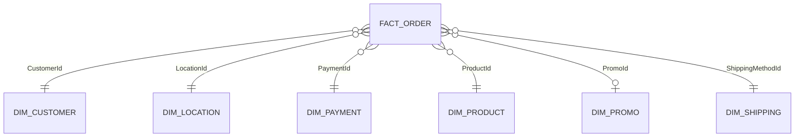

# Data model

The Tableau model follows a fact-and-dimension structure using relationships rather than physical joins.

## Tables

- `factOrder`: order-line transactions, dates, revenue, quantity, units, cost and foreign keys
- `dimCustomer`: customer reference data
- `dimLocation`: state, abbreviation, population and region
- `dimPayment`: payment provider and method
- `dimProduct`: product, SKU, category and subcategory
- `dimPromo`: promotion code, campaign, type and amount
- `dimShipping`: shipping type and method

The promotion relationship is optional because some order lines have no promotion.
